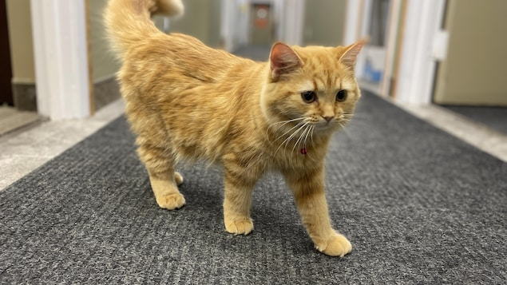
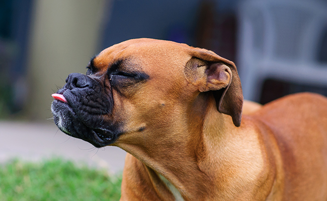

# {{ cookiecutter.nom_projet }}

Aujourd'hui {{ cookiecutter.auteur }} a décidé de vous présenter un tutoriel sur les outils qui vont vous rendre plus efficace en entreprise.  



## Voici un petit chat



## Voici un chien



## Le p'tit canadien tannant



## VOID

.


